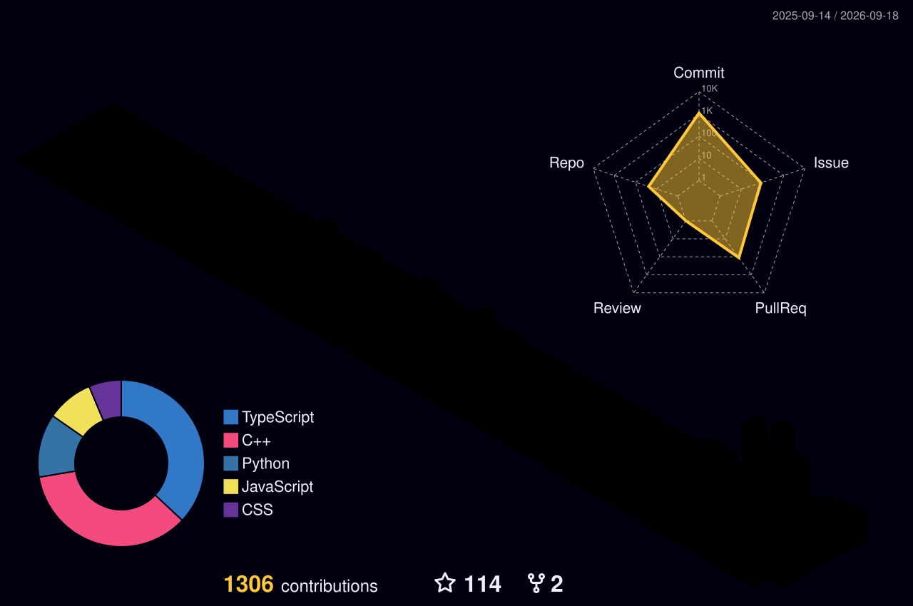
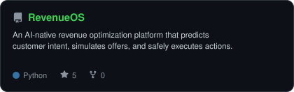
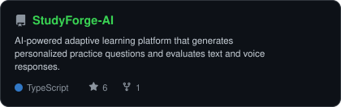
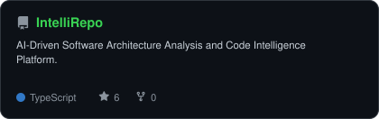
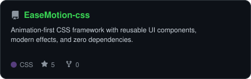

<!-- PORTRAIT - generated by scripts/dotify.py from assets/jacket.png.
     Colour mode, so one file serves both GitHub themes. Regenerate with:
       python scripts/dotify.py assets/jacket.png -o assets/portrait \
         --cols 100 --equalize --detail 0.5 --color -->

 

<!-- NAME / TAGLINE - animated typing -->

   

<!-- SOCIALS -->

  

 

<h2 align="center">About Me</h2>

Hi, I'm **Jaya Sai Krishna**, a **Full Stack Python AI Developer**. I build intelligent applications that bridge the gap between AI and the web, and I'm currently diving deep into mastering **Data Structures & Algorithms**.

- 🎓 **Computer Science and Engineering** student at **Aditya University**
- 🚀 Currently building **[Sage](https://github.com/JAY4IGNITE/Sage)** and **[Spyder](https://github.com/JAY4IGNITE/spyder_frontend)**
- 🧠 Learning **Data Structures & Algorithms**
- ⚡ Fun fact: **I started coding seriously because I wanted to build things I wished existed.**

 

<h2 align="center">Tech Stack</h2>

| Category | Technologies |
| :--- | :--- |
| **Web Development** |  |
| **Backend & Database** |  |
| **AI & Core** |  |
| **Tools & Platforms** |  |

 

<h2 align="center">GitHub Activity</h2>

<!-- 3D Lego calendar, regenerated by .github/workflows/lego-3d.yml -->
<picture>
  <source media="(prefers-color-scheme: dark)"  srcset="profile-3d-contrib/profile-night-rainbow.svg">
  <source media="(prefers-color-scheme: light)" srcset="profile-3d-contrib/profile-gitblock.svg">
  
</picture>

  

<!-- Snake eats the contribution graph - .github/workflows/snake.yml -->
<picture>
  <source media="(prefers-color-scheme: dark)"  srcset="dist/snake-dark.svg">
  <source media="(prefers-color-scheme: light)" srcset="dist/snake.svg">
  
</picture>

 

<h2 align="center">Statistics</h2>

<table>
<tr>
<td width="50%" align="center" valign="top">
  
</td>
<td width="50%" align="center" valign="top">
  
</td>
</tr>
<tr>
<td colspan="2" align="center" valign="top">
   
  
</td>
</tr>
</table>

 

<h2 align="center">Featured Projects</h2>

<!-- Cards generated by scripts/cards.py from assets/projects.json.
     Stars, forks and language are pulled live from the API on every run. -->
<table>
<tr>
<td width="50%">
  <a href="https://github.com/JAY4IGNITE/RevenueOS">
    <picture>
      <source media="(prefers-color-scheme: dark)"  srcset="assets/card-RevenueOS-dark.svg">
      <source media="(prefers-color-scheme: light)" srcset="assets/card-RevenueOS-light.svg">
      
    </picture>
  </a>
</td>
<td width="50%">
  <a href="https://github.com/JAY4IGNITE/StudyForge-AI">
    <picture>
      <source media="(prefers-color-scheme: dark)"  srcset="assets/card-StudyForge-AI-dark.svg">
      <source media="(prefers-color-scheme: light)" srcset="assets/card-StudyForge-AI-light.svg">
      
    </picture>
  </a>
</td>
</tr>
<tr>
<td width="50%">
  <a href="https://github.com/JAY4IGNITE/IntelliRepo">
    <picture>
      <source media="(prefers-color-scheme: dark)"  srcset="assets/card-IntelliRepo-dark.svg">
      <source media="(prefers-color-scheme: light)" srcset="assets/card-IntelliRepo-light.svg">
      
    </picture>
  </a>
</td>
<td width="50%">
  <a href="https://github.com/JAY4IGNITE/EaseMotion-css">
    <picture>
      <source media="(prefers-color-scheme: dark)"  srcset="assets/card-EaseMotion-css-dark.svg">
      <source media="(prefers-color-scheme: light)" srcset="assets/card-EaseMotion-css-light.svg">
      
    </picture>
  </a>
</td>
</tr>
</table>

| project | live | stack |
|---|---|---|
| **[RevenueOS](https://github.com/JAY4IGNITE/RevenueOS)** | - | `Python` `AI` |
| **[StudyForge-AI](https://github.com/JAY4IGNITE/StudyForge-AI)** | - | `TypeScript` `AI` |
| **[IntelliRepo](https://github.com/JAY4IGNITE/IntelliRepo)** | - | `TypeScript` `Code Intelligence` |
| **[EaseMotion-css](https://github.com/JAY4IGNITE/EaseMotion-css)** | - | `CSS` `Framework` |

---

`01110100 01101000 01100001 01101110 01101011 01110011 00100000 01100110 01101111 01110010 00100000 01110011 01100011 01110010 01101111 01101100 01101100 01101001 01101110 01100111`

